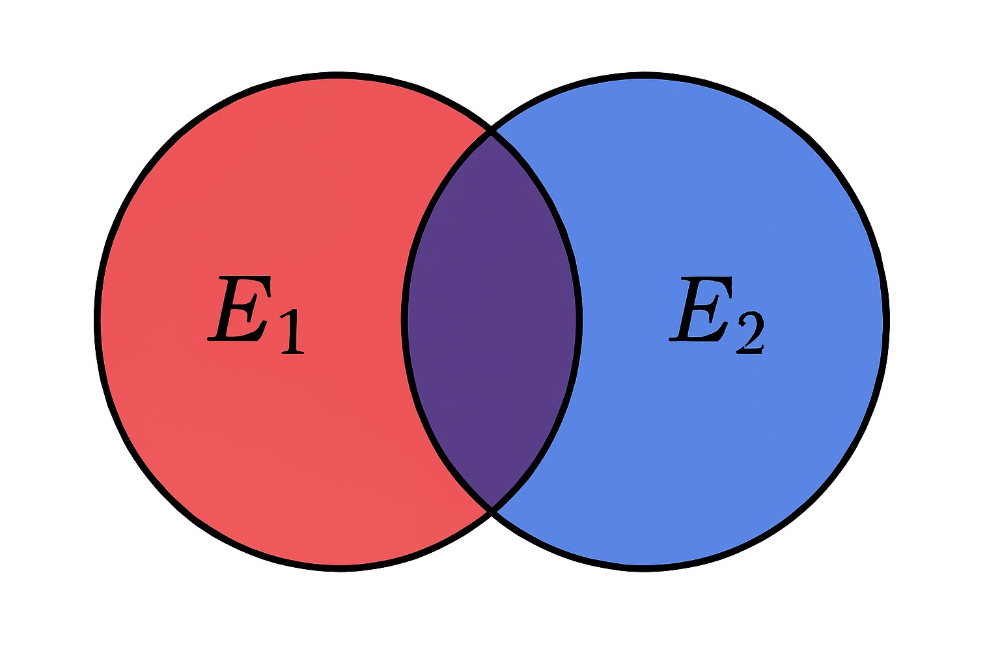

Statistical analysis lies at the very core of any experiments, directly governing what conclusions can be drawn from the observations. What many physicists lack, mostly due to no formal training on the matter is a deep understanding of probability and statistics. I personally have been lucky to have had some some mentors during the course of my PhD who helped push me down this path of furthering my understanding of statistics. This resulted in what I believe to be a quite nice statistical analysis section in my thesis. The following will be an adaption of this work, covering the basics of probabilities and likelihoods, and how we use them to construct hypothesis tests. 

## Probability and Likelihood
<!-- 
To really dive deep into statistics we have to be able to disentangle the concepts of probability and likelihood. Though, the issue here is that the two are typically entangled in their definitions. You may see -->

Put simply, probability is the likelihood that an event will happen. For example, rolling a 2 on a six sided dice has the probability of 1/6. The basic axioms of probability established by Kolmogorov in 1933 are as follows:

1. The probability of an event is non-negative, $P(E)\geq 0$.
2. The probability of all possible events is one, $S = {E}$, $P(S) = 1$.
3. The probability of uncorrelated events is additive, $P(E_1 \cup E_2) = P(E_1) + P(E_2)$

The two merely construct the space within which probability can exists. It is not possible for an event to occur with a negative chance. It is also not possible for probability assigned to all events to exceed one. While I hope we agree on these points the third certainly leaves room for discussion. 

First, we must discuss additional relations. If I roll two die, the probability of rolling two 2's is 1/36. This is because,

$$
P(E_1\cap E_2) = P(E_1)\times P(E_2)
$$

This becomes much clearer when graphically represented. The intersection $\cap$ is the overlap between the two events. The union $\cup$ is the total space enclosed by the events. You can consider the space enclosed by E_1 to be all possible ways the event can be true e.g. all possible bounces the dice can have. The size of the enclosed area is also a representation of the total probability of the event. 

Now back to the third axiom. If I roll a dice, the probability of attaining a 1 or a 2 is 1/3. This is because the events are mutually exclusive  ($E_1\cap E_2 =\emptyset$) - they're probability spaces don't overlap like in FIGURE. If Sasha and I go fishing in a lake, one may assign us each, according to our gear and fishing skill, a 50% chance of catching a fish over the next hour. A naive interpretation of the third axiom would tell us there a 100% chance that one of those two events occur. This touches on the limited scope of the third, which only holds true for exclusive events. When I go fishing with Sasha, we must consider the probability that we both catch a fish, which in this case is $P(E_1)\times P(E_2) = 0.5\times0.5 = 0.25$. If we return to FIGURE, then by simply adding the area of the two as dictated by the third axiom, the intersecting region is double counted. Thus in the more general case we write,

$$
P(E_1\cup E_2) = P(E_1) + P(E_2) - P(E_1\cap E_2)
$$

<!-- 
## Likelihood functions

In this section I will give an introduction to likelihoods.

## Neyman-Pearson Lemma

In this section I will provide the Neyman-Pearson lemma

## A basic example of hypothesis testing

In this section I will give a basic example of hypothesis testing. 

## Below is a dump from my thesis.

In search for new physics we employ two hypothesis tests: the null hypothesis ($H_0$), which posits that the observed data is explained by background only, and the alternate hypothesis ($H_1$), which suggests the observation is explained by the presence of a new signal amongst the background. This formalism is essential for the discovery of new physics as it allows us to first reject the null hypothesis in favour of the alternative.

The basis of hypothesis testing begins with the construction of a likelihood. To illustrate the use of a likelihood, we can begin with a toy example. Consider a counting experiment. The likelihood measuring $n$ events is,

$$
L(n_\text{obs}|\nu) = \frac{\nu^{n_\text{obs}} e^{-\nu}}{n_\text{obs}!}
$$

where $\nu$ is the number of expected events predicted by the underlying hypothesis. The basis of either hypothesis is the number of expected events which can be written as,

$$
\nu = \mu S + B
$$

where $\nu$ is the expected yield, $B$ is the predicted background, $S$ is the nominally predicted signal and $\mu$ is the scaling factor for the signal. The parameter $\mu$, referred to as the signal strength, allows for different signal hypotheses to be tested, including the background-only hypothesis of $\mu = 0$.

In reality the predictions of the signal and background contain underlying uncertainties. Consider a Gaussian uncertainty on the signal of 20%. In the likelihood, we allow the uncertainty to modify the signal as $S(\theta) = (1 + 0.2\theta)S_\text{nom}$, where $S_\text{nom}$ is the nominal prediction for the number of signal events and $\theta$ is the _nuisance parameter_ (NP), which follows a standardized[^1] Gaussian distribution. Correspondingly, a Gaussian distribution is appended to the likelihood. This term is known as a constraint as it penalizes non-nominal values of $\theta$. With this information, the likelihood is thus modified as:

$$
L(n_\text{obs}|\nu, \theta) = \frac{(\mu S(\theta)+B)^{n_\text{obs}} e^{-(\mu S(\theta)+B)}}{n_\text{obs}!} \cdot \frac{e^{-\theta^2/2}}{\sqrt{2\pi}}
$$

With the likelihood constructed, a *fit* can be conducted by finding the values of $\mu$ and $\theta$ which maximize the likelihood. Typically, it is computationally simpler to minimize the negative-log of the likelihood, hence this formalism will appear later on.

[^1]: As the uncertainty manifests in the modifying term, the Gaussian is *standardized*, meaning it has standard deviation of 1. -->
