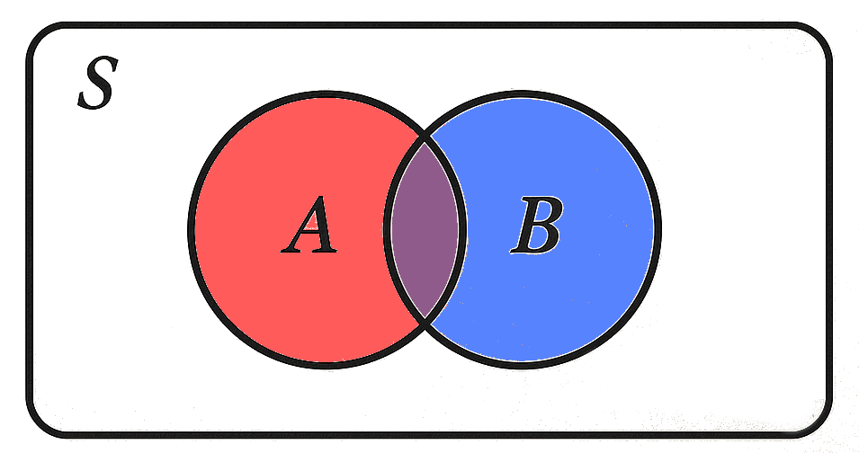
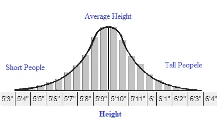

Statistical interpretation lies at the very core of any experiment, directly governing what conclusions can be drawn from the observations. What many physicists lack, mostly due to no formal training on the matter is a deep understanding of probability and statistics. I personally have been lucky to have had some mentors during the course of my PhD who helped push me down this path of furthering my understanding of statistics. This resulted in what I believe to be quite a nice statistical analysis section in my thesis. The following will be an adaption of this work, covering the basics of probabilities and likelihoods, and how we use them to construct hypothesis tests. 

## A simple introduction to probability and likelihood
<!-- 
To really dive deep into statistics we have to be able to disentangle the concepts of probability and likelihood. Though, the issue here is that the two are typically entangled in their definitions. You may see -->

Put simply, probability is the likelihood that an event will happen. I realize this may be confusing as I'm immediately conflating the two terms. In reality, probability is a measure we use before observing data to describe how likely different outcomes are. While likelihood is used after observing data to determine how likely different underlying models are to generate the observed data. I hope to make this clear over time, but for now let's build on the concept of probability with the image of rolling a dice. The probability of rolling a 2 on a six-sided dice is 1/6. The probability of rolling any number is 1. The probability of rolling an even number of 1/2. Those are just a few examples of way in which we can construct probability from simple model. Regardless of the simplicity or complexity of the model, these measures of probability all exist within the confines of the axioms of probability established by Kolmogorov in 1933:

1. The probability of an event is non-negative, $P(E)\geq 0$.
2. The probability of all possible events is one, $S = {E}$, $P(S) = 1$.
3. The probability of exclusive events is additive, $P(A \cup B) = P(A) + P(B)$

The two merely construct the bounds within which probability can exists. It is not possible for an event to occur with a negative chance. It is also not possible for probability assigned to all events to exceed one. While I hope we agree on these points the third certainly leaves room for discussion. 

First, we must discuss additional relations. If I roll a dice, the probability of rolling a 2 or 3  1/3. This follows simply from the third axiom. 

<!-- This becomes much clearer when graphically represented by Figure 1. The intersection $\cap$ is the overlap between the two events. The union $\cup$ is the total space enclosed by the events. You can consider the space enclosed by $E_1$ to be all possible ways the event can be true e.g. all possible bounces the dice can have. The size of the enclosed area is also a representation of the total probability of the event.  -->

<figure style="text-align: center;">
    
    <figcaption style="font-size: 1em;">Figure 1: This is the probability picture.</figcaption>
</figure>

Now if we consider a separate example, of Sasha and I going fishing on a lake. One may assign to us each, according to our gear and fishing skill, a 50% chance of catching a fish over the next hour. A naive interpretation of the third axiom would tell us there's a 100% chance that one of those two events occur. This touches on the limited scope of the third, which only holds true for exclusive events.

An example of non-exclusive events is demonstrated in Figure 1. The total probability space is $S$, which contains two events, $A$ and $B$. These events overlap which means, there is a chance that both occur simultaneously. This overlapping region is called the intersect, defined as $A\cap B$. The total space enveloped by $A$ and $B$, thus being the probability that at least one be true, is the union of the two $A\cup B$. 

Now let's return to the fishing example. If we want to consider the probability that either sasha or I catch a fish, while we can start from the third axiom but we must be certain to not double count the intersect whose probability exists in both $P(A)$ and $P(B)$. To correct this we write,

$$
P(A\cup B) = P(A) + P(B) - P(A\cap B)
$$

The above text general covers most scenarios for simple unconditional probability. There are of course other permutation such as the probability of one event and not the other, but these can be simply derived following my discussion of Figure 1.

Next we must consider conditional probabilities. That is, how can we define probability of an event, given another correlated event has occurred. Let's start with the example of a deck of cards. The probability the probability of drawing a face card is 12/52 while the probability of drawing a king is 4/52. Through simple counting we can resolve that the probability of the card being a king if it is a face card is 1/3. This is due to the following relation of conditional probability,

$$
P(A|B) = \frac{P(A\cap B)}{P(B)}
$$

Again, this can be related to Figure 1. As $P(A\|B)$ defines the probability of $A$ given $B$ is already true, it is simply the fraction of the intersect of $A$ and $B$ within $B$.

To this point, only discrete variables have been considered. That means, as we roll a dice the result value $n$ is within the set $[1, 2, 3, 4, 5, 6]$. There is a countable number of possible outcomes. Whether the set is infinitely large has no relevance. The importance is whether the elements can be enumerated one by one. On the other hand, a continuous random variable is sampled from a set whose elements are uncountable. Consider the set of real numbers. If you were to choose any two number, no matter how small, there exists an infinite number of numbers between those two. 

Continuous number start to blur our previous descriptions of probability. Consider the following scenario, you have stopwatch with an infinite number of digits. What is the probability you are able to stop the timer at exactly 5 seconds. The answer is zero. This shows us we can no longer assign probabilities to individual element of the set. Nevertheless, it is always possible to stop the timer between 4.9 and 5.1 seconds. Therefore, probabilities can still be assigned to intervals. 

For these reasons we need a probability density function (PDF). The axioms for a PDF $f(x)$ where $x$ is the random variable we are sampling are:

1. The function is always non-negative, $f(x) \geq 0$
2. The area under the function is one, $\int_{-\infty}^\infty f(x) = 1$

These two rules are the reinterpretation of the first two Kolmogorov axioms but for continuous random variables. The third rule to establish for the PDF is what guides us in interpreting its meaning. That is,

$$
\int_{a}^{b}f(x) = P(a \leq x \leq b)
$$

One of the most common probability distributions is the Gaussian distribution, or also coined the normal distribution (or even worse - the bell curve),

$$
f(x) = \frac{1}{\sqrt{2\pi \sigma^2}}e^{-\frac{(x-\mu)^2}{2\sigma^2}}
$$

where $x$ is once again the random variable, $\mu$ is the mean of the distribution and $\sigma^2$ is the variance or rather the spread of the distribution. Gaussian distribution are used to model many aspects of life, such as the distribution of human height. There is a mean height of roughly 5'9, this means it is most the most likely of heights. The are people who are taller but as can be seen this is increasingly less likely. Similarly to the left, there are shorter people, such as Tom, but this also is increasingly less likely.

<figure style="text-align: center;">
    
    <figcaption style="font-size: 1em;">Figure 2: The distribution of human height.</figcaption>
</figure>

<!-- When I go fishing with Sasha, we must consider the probability that we both catch a fish, which in this case is $P(E_1)\times P(E_2) = 0.5\times0.5 = 0.25$. If we return to Figure 1, then by simply adding the area of the two as dictated by the third axiom, the intersecting region is double counted. Thus in the more general case we write,

Now back to the third axiom. If I roll a dice, the probability of attaining a 1 or a 2 is 1/3. This is because the events are mutually exclusive  ($E_1\cap E_2 =\emptyset$) - they're probability spaces don't overlap like in Figure 1. 

$$
P(E_1\cup E_2) = P(E_1) + P(E_2) - P(E_1\cap E_2)
$$ -->

<!-- 
## Likelihood functions

In this section I will give an introduction to likelihoods.

## Neyman-Pearson Lemma

In this section I will provide the Neyman-Pearson lemma

## A basic example of hypothesis testing

In this section I will give a basic example of hypothesis testing. 

## Below is a dump from my thesis.

In search for new physics we employ two hypothesis tests: the null hypothesis ($H_0$), which posits that the observed data is explained by background only, and the alternate hypothesis ($H_1$), which suggests the observation is explained by the presence of a new signal amongst the background. This formalism is essential for the discovery of new physics as it allows us to first reject the null hypothesis in favour of the alternative.

The basis of hypothesis testing begins with the construction of a likelihood. To illustrate the use of a likelihood, we can begin with a toy example. Consider a counting experiment. The likelihood measuring $n$ events is,

$$
L(n_\text{obs}|\nu) = \frac{\nu^{n_\text{obs}} e^{-\nu}}{n_\text{obs}!}
$$

where $\nu$ is the number of expected events predicted by the underlying hypothesis. The basis of either hypothesis is the number of expected events which can be written as,

$$
\nu = \mu S + B
$$

where $\nu$ is the expected yield, $B$ is the predicted background, $S$ is the nominally predicted signal and $\mu$ is the scaling factor for the signal. The parameter $\mu$, referred to as the signal strength, allows for different signal hypotheses to be tested, including the background-only hypothesis of $\mu = 0$.

In reality the predictions of the signal and background contain underlying uncertainties. Consider a Gaussian uncertainty on the signal of 20%. In the likelihood, we allow the uncertainty to modify the signal as $S(\theta) = (1 + 0.2\theta)S_\text{nom}$, where $S_\text{nom}$ is the nominal prediction for the number of signal events and $\theta$ is the _nuisance parameter_ (NP), which follows a standardized[^1] Gaussian distribution. Correspondingly, a Gaussian distribution is appended to the likelihood. This term is known as a constraint as it penalizes non-nominal values of $\theta$. With this information, the likelihood is thus modified as:

$$
L(n_\text{obs}|\nu, \theta) = \frac{(\mu S(\theta)+B)^{n_\text{obs}} e^{-(\mu S(\theta)+B)}}{n_\text{obs}!} \cdot \frac{e^{-\theta^2/2}}{\sqrt{2\pi}}
$$

With the likelihood constructed, a *fit* can be conducted by finding the values of $\mu$ and $\theta$ which maximize the likelihood. Typically, it is computationally simpler to minimize the negative-log of the likelihood, hence this formalism will appear later on.

[^1]: As the uncertainty manifests in the modifying term, the Gaussian is *standardized*, meaning it has standard deviation of 1. -->
